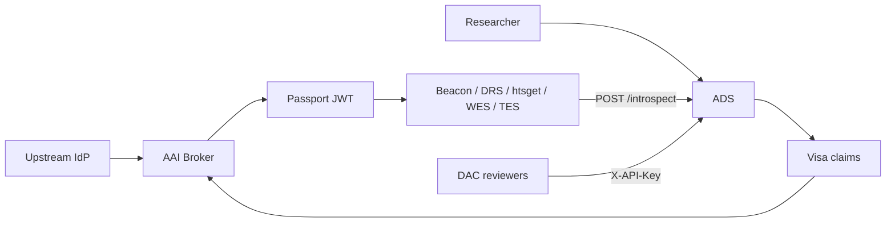

# ADS architecture

The **Access Decision Service (ADS)** sits between the GA4GH AAI (broker + Passports) and
resource services (Beacon v2, DRS, htsget, WES, TES). It is the system of record for
**grants** — canonical permissions that may originate from DAC approval, DUO auto-approval,
or institutional OIDC claim mappings.

## Position in the stack



## Core responsibilities

| Area | ADS role |
|------|----------|
| Identity | Trust broker-issued JWTs; OIDC `sub` is the researcher id |
| Authorization | Issue and revoke **grants**; grants are canonical permissions |
| DUO | Store dataset/project DUO; evaluate compatibility; optional auto-approval |
| DAC | Queue, approve, reject, escalate; immutable decision audit trail |
| Visas | Export `ControlledAccessGrants` and `AffiliationAndRole` claims for the broker |
| Introspection | Resource services validate Passports against active grants |
| Events | Emit `grant.*` and `request.*` audit events |

## Crate layout

- `crates/ga4gh-types/src/ads.rs` — shared domain types
- `crates/access-decision-service/` — HTTP API, persistence, workflows
- `docs/ads/openapi.yaml` — OpenAPI 3.0 specification

## Security model

- **Researcher endpoints** — `Authorization: Bearer` JWT from a trusted broker (JWKS validation via `ga4gh-clearinghouse`)
- **DAC / admin endpoints** — `X-API-Key` (hashed at rest, bootstrap key from environment)
- **Introspection** — resource service API key or Bearer JWT

## Related services

ADS complements existing `ga4gh-infra` components:

- **aai-broker** — assembles Passports; ADS supplies visa material via `/researchers/{id}/visas`
- **visa-registry** — may sign ADS-exported visa claims into JWTs
- **duo-service** — term catalog; ADS embeds DUO evaluation for access decisions
- **agreement-registry** — optional policy-profile compatibility (library); ADS uses lighter in-service DUO matching today

## Configuration

See `config/ads.example.toml`. Run via:

```bash
ga4gh-infra access-decision-service --config config/ads.toml
```

Set `ADS_DATABASE_URL` and `ADS_DAC_API_KEY` in the environment.
