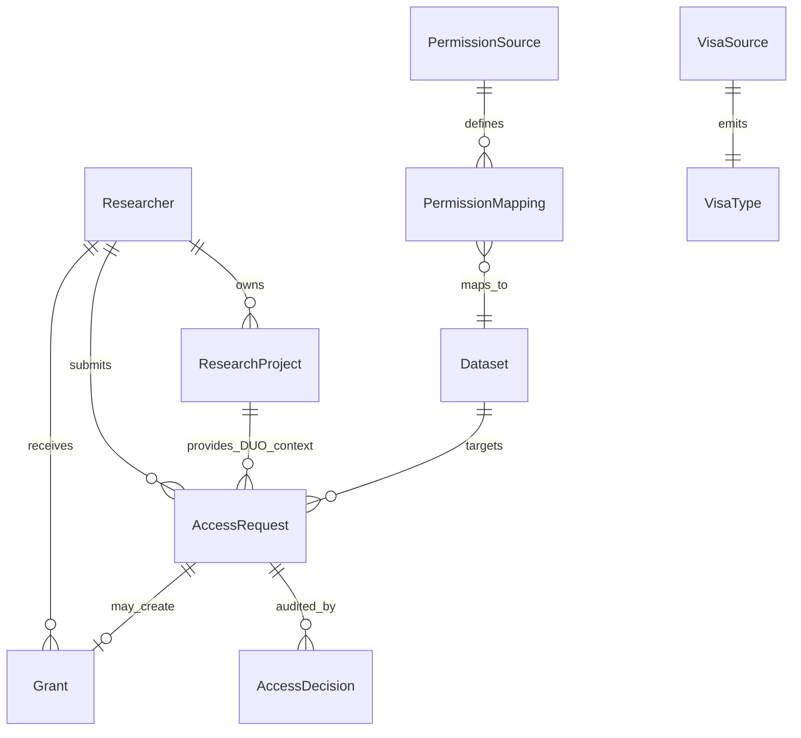

# ADS domain model

Types are defined in `crates/ga4gh-types/src/ads.rs` and persisted by `access-decision-service`.

## Entity relationship

## Entities

### Researcher

Canonical identity is the OIDC **`sub`** from the GA4GH AAI broker. Affiliations feed
`AffiliationAndRole` visa export.

### Dataset

Controlled-access resource registered with ADS. Carries **DUO codes**, optional
`external_id` (DRS id, Beacon dataset id), and auto-approval settings (`auto_approve_enabled`,
`auto_approve_threshold` 0–100).

### ResearchProject

Researcher's declared intended use with **project DUO codes**. Access requests reference
a project for compatibility evaluation.

### AccessRequest

Links researcher, dataset, and project. Status: `pending`, `approved`, `rejected`, `escalated`.
Stores a **DUO evaluation snapshot** at submission.

### AccessDecision

Immutable audit record for DAC or system actions (`dac:{name}`, `system:duo-auto`).
Outcomes: `approved`, `rejected`, `escalated`.

### Grant

**Canonical permission.** Sources:

| Source | Description |
|--------|-------------|
| `dac_approval` | Human DAC approved the access request |
| `duo_auto_approval` | DUO compatibility met dataset auto-approval threshold |
| `institutional_mapping` | OIDC claim mapping (configuration present; workflow extensible) |

Grants support `expires_at` and `revoked_at` for time-bound and revocable access.

### VisaSource

Configuration for visa issuers ADS exposes to the AAI (issuer URL, visa type).

### PermissionSource / PermissionMapping

Institutional OIDC claim paths and values mapped to dataset grants (e.g. IdP group
`ega-approved-researchers` → dataset access).

## Grant as source of truth

Resource services should not re-implement DAC logic. They call **`POST /ads/v1/introspect`**
with the researcher's Passport and resource id; ADS checks active grants.

Visa export (`GET /researchers/{id}/visas`) is a **view** over grants + affiliations for
broker passport assembly — not a separate permission store.
