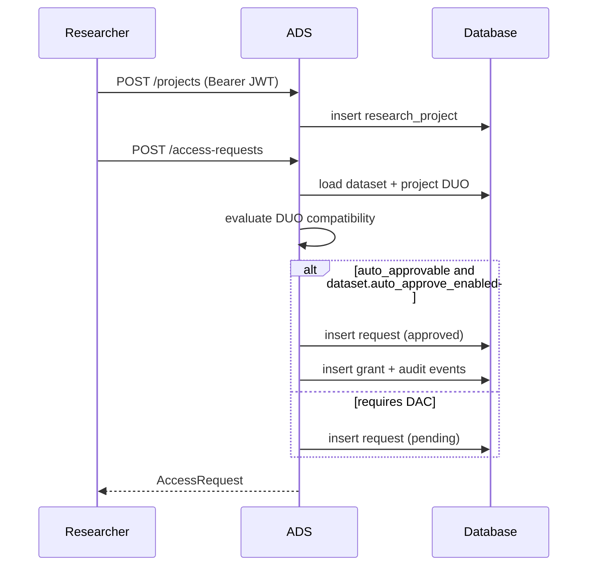
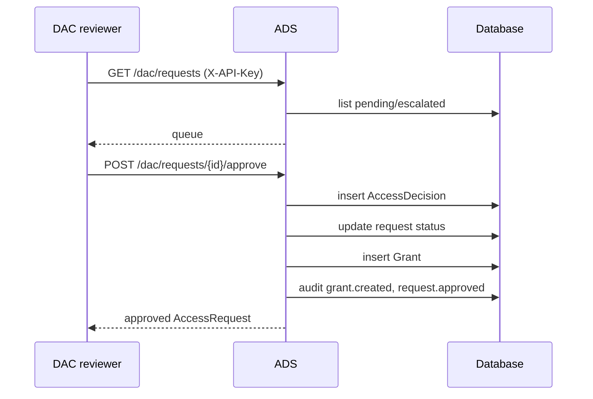
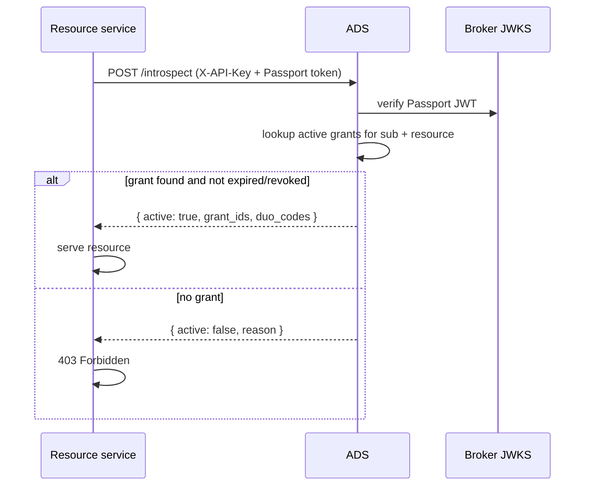
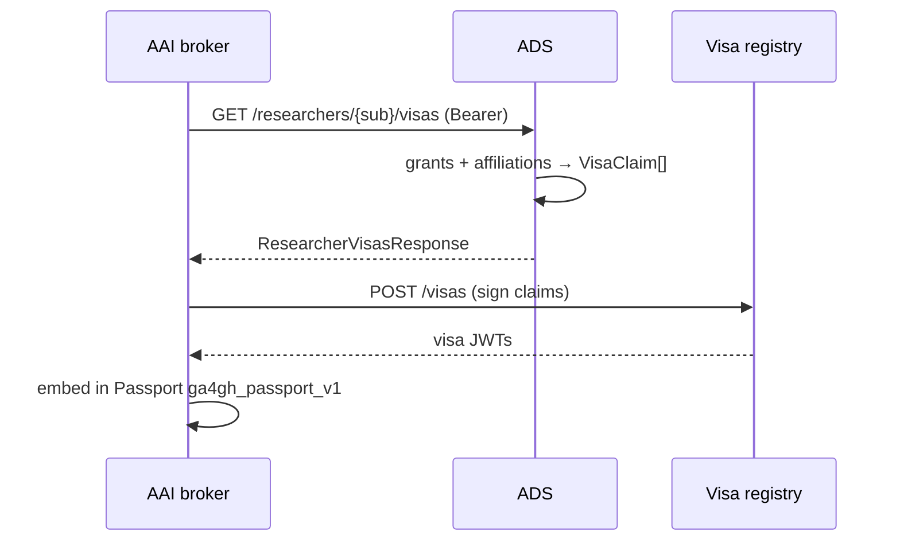
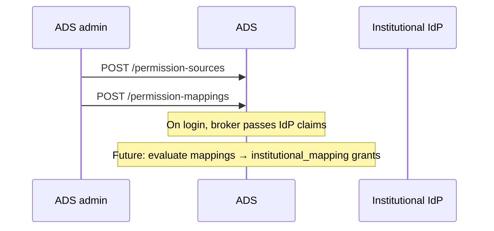

# ADS sequence diagrams

## Access request with DUO auto-approval

## DAC review workflow

## Passport introspection (DRS / Beacon / htsget / WES / TES)

## Visa export for AAI passport assembly

## Institutional permission mapping (configuration)

Institutional mapping evaluation at login is configured via `permission-sources` and
`permission-mappings`; grant creation from IdP claims can be extended in a broker callback hook.
