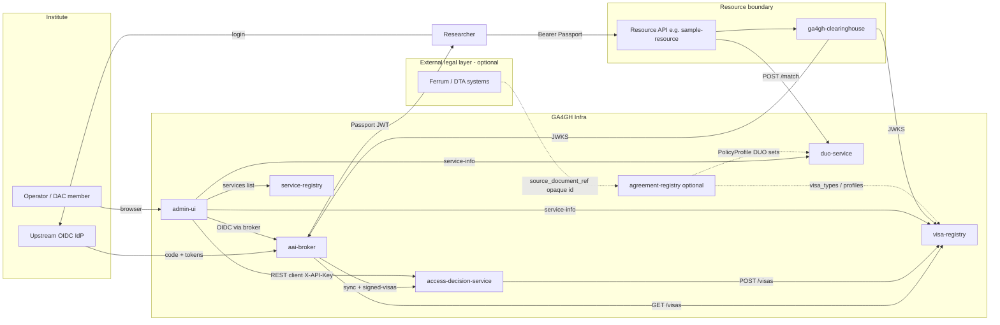

# GA4GH Infra Architecture

This document describes how the `ga4gh-infra` workspace fits together and how data flows from institute login through Passport issuance, visa validation, and DUO policy checks.

## Broker as OIDC Relying Party (not an Authorization Server)

The **aai-broker** delegates authentication to institute IdPs. It does **not** host login pages, issue upstream OIDC tokens, or provide `/introspect`. Researchers log in at the home IdP; the broker completes the OIDC code + PKCE flow, fetches visas, and mints a GA4GH **Passport** JWT signed by the broker.

Resource services never call the broker to validate tokens. They use **`ga4gh-clearinghouse`** to verify Passport signatures, issuers, expiry, embedded visas, and policy rules locally.

See [design-decisions.md](design-decisions.md) for the full rationale.

## System overview



`agreement-registry` is **optional** and loosely coupled — broker, visa-registry, duo-service, and clearinghouse do not depend on it. It operationalizes MRCG-style policy-to-DUO translation and institution compatibility (levels 2–3). See [agreement-registry/architecture.md](agreement-registry/architecture.md).

## Components

| Service | Port | Role |
|---------|------|------|
| `aai-broker` | 8080 | OIDC Relying Party; mints GA4GH Passports after upstream IdP login |
| `visa-registry` | 8081 | Stores unsigned visa assertions; signs and serves visa JWTs |
| `access-decision-service` | 8090 | Access requests, DUO evaluation, DAC workflows, grants, visa export |
| `duo-service` | 8082 | DUO term catalog and dataset/intended-use matching |
| `service-registry` | 8083 | GA4GH service discovery registry |
| `sample-resource` | 8084 | Reference resource API using clearinghouse axum integration |
| `admin-ui` | 8095 | Server-rendered ops dashboard (Askama + htmx); REST client of ADS, broker, DUO, registries |
| `mock-idp` | 9000 | Test upstream OIDC provider (docker/CI only) |
| `ga4gh-clearinghouse` | library | Validates Passports and Visas at resource boundaries |
| `ga4gh-types` | library | Shared GA4GH data structures (Passport, Visa, DUO, agreement profiles) |
| `agreement-registry` | optional service | Policy profiles, agreement templates, compatibility checks (Phase 8) |

PostgreSQL backs `visa-registry`, `service-registry`, and `access-decision-service` in production stacks; visa-registry and ADS also support SQLite for demo/edge (see [configuration.md](configuration.md)).

## Authentication and Passport flow

```
Researcher          Browser/Client       aai-broker        mock-idp         visa-registry
    |                      |                  |                 |                  |
    |---- GET /login ------>|                  |                 |                  |
    |                      |--- redirect ---->|                 |                  |
    |                      |                  |-- authorize --->|                  |
    |                      |<-- 302 callback -|<-- code+state ---|                  |
    |                      |--- /callback -->|                 |                  |
    |                      |                  |-- token exchange->|                  |
    |                      |                  |<- id_token -------|                  |
    |                      |                  |--- GET /visas?sub ----------------->|
    |                      |                  |<- signed visa JWTs ------------------|
    |                      |                  | mint Passport JWT (visas embedded)   |
    |                      |<- access_token --|                 |                  |
    |                      |                  |                 |                  |
    |                      |  Clearinghouse library (resource service boundary)     |
    |                      |--- validate_passport(passport_jwt) ------------------>|
    |                      |--- extract_visas() --------------------------------->|
    |                      |--- check_policy(ControlledAccess) ----------------->|
    |                      |                  |                 |                  |
    |                      |--- POST /match (dataset DUO vs intended use) --------> duo-service
    |                      |--- GET /datasets/{id} (Passport + policy) ----------> sample-resource
```

### Sample resource service

The `sample-resource` binary demonstrates how a GA4GH resource service (DRS, Beacon, etc.) can protect endpoints:

1. **`ExtractedPassport`** — axum extractor validates the `Authorization: Bearer` Passport JWT via `ga4gh-clearinghouse`.
2. **`GET /datasets/{id}`** — when `[ads]` is configured, calls `POST /ads/v1/introspect`; otherwise (or if introspection is inactive) checks embedded visas via `PolicyCheck::HasControlledAccess`.
3. **`GET /datasets/{id}/summary`** — same access check, then calls `duo-service` `/match` using `X-GA4GH-Intended-Use` (or dataset defaults).

Unauthenticated or under-privileged requests receive GA4GH-shaped JSON errors (`401`, `403`) without custom auth logic in each handler.

### Step-by-step

1. **Upstream login** — The broker starts an OIDC authorization code + PKCE flow with the institute IdP (`mock-idp` in docker).
2. **Callback** — The broker exchanges the authorization code, validates the upstream ID token, and resolves the researcher `sub`.
3. **Visa collection** — The broker calls `GET /visas?sub=` on each configured visa source and collects signed visa JWT strings.
4. **Passport minting** — The broker embeds visa JWTs in a GA4GH Passport JWT signed with the broker key.
5. **Clearinghouse validation** — A resource service (or the e2e test) validates the Passport signature, issuer, and expiry, then validates embedded visas against trusted issuer JWKS.
6. **Policy checks** — The clearinghouse evaluates `PolicyCheck` expressions (controlled access, affiliation, DUO permissions).
7. **DUO matching** — The duo-service evaluates whether a researcher's intended use satisfies dataset DUO codes using the compiled ontology hierarchy.

## Admin UI (`admin-ui`)

The **admin-ui** crate (Phase 9) is an **aggregator**: it has no database and no domain logic of its own. It authenticates operators via the same **aai-broker** OIDC flow, stores a long-lived UI session cookie, and calls existing service REST APIs server-side (primarily ADS with the configured DAC API key).

```
Operator browser → admin-ui (8095)
                    ├─ GET /login → redirect to broker
                    ├─ POST /auth/session ← broker access_token
                    ├─ GET /dac/queue, POST approve/reject (htmx → ADS)
                    ├─ GET /datasets, /grants, /audit (→ ADS)
                    └─ GET /services (→ service-registry)
```

See [admin-ui/overview.md](admin-ui/overview.md) for page list, roles, and configuration.

## Docker stack

Start the full stack:

```bash
docker compose -f docker/docker-compose.yml --env-file docker/.env.example up --build --wait
```

Run the end-to-end test (stack must be running):

```bash
./scripts/e2e.sh
```

Or manually:

```bash
cargo test -p ga4gh-e2e -- --ignored --test-threads=1
```

The stack includes **admin-ui** on port **8095**. The `stack_admin_ui_approves_dac_request_via_htmx` test logs in via the broker, establishes an admin-ui session, approves a pending DAC request through the htmx endpoint, and verifies the grant via ADS.

### Environment defaults (development)

| Variable | Default |
|----------|---------|
| `BROKER_COOKIE_SECRET` | `dev-broker-cookie-secret` |
| `MOCK_IDP_CLIENT_SECRET` | `mock-client-secret` |
| `REGISTRY_BOOTSTRAP_API_KEY` | `dev-visa-api-key` |
| `SERVICE_REGISTRY_REGISTRATION_KEY` | `dev-service-registry-key` |
| `ADS_DAC_API_KEY` | `dev-ads-api-key` (used by admin-ui server-side) |

Test signing keys live in `docker/secrets/` and must not be used in production.

### Service self-registration

Internal services register with the service registry using `docker/scripts/register-service.sh`:

```bash
GA4GH_SERVICE_ID=org.localhost.aai-broker \
GA4GH_SERVICE_NAME="GA4GH AAI Broker" \
GA4GH_SERVICE_ARTIFACT=passport \
GA4GH_SERVICE_URL=http://localhost:8080 \
  docker/scripts/register-service.sh
```

Production deployments should set `read_only = true` on the public service registry and keep registration on the internal Docker network only.

## Published crates

- **`ga4gh-types`** — Shared structs and serde implementations
- **`ga4gh-clearinghouse`** — Passport/Visa validation library (optional `axum` feature with `ExtractedPassport` and `ClearinghouseState`)

Other crates are deployable binaries. **`sample-resource`** demonstrates the clearinghouse axum integration in a protected HTTP API.

See [roadmap.md](roadmap.md) for project status. Full doc index: [README.md](README.md).

## Standards

- [GA4GH AAI OIDC Profile v1.2](https://ga4gh.github.io/data-security/aai-openid-connect-profile)
- [GA4GH Passport & Visa specification](https://github.com/ga4gh-duri/ga4gh-duri.github.io/blob/master/researcher_ids/ga4gh_passport_v1.md)
- [GA4GH Service Info](https://github.com/ga4gh-discovery/ga4gh-service-info)
- [GA4GH Service Registry](https://github.com/ga4gh-discovery/ga4gh-service-registry)
- [Data Use Ontology (DUO)](https://github.com/EBISPOT/DUO)
